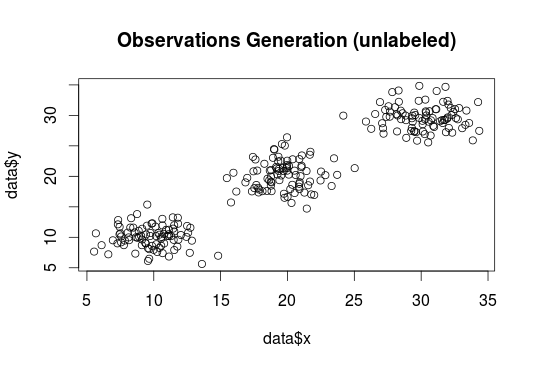

## K-means

The next machine learning method I'd like to introduce is about clustering, K-means. It is an unsupervised learning method where we would like to group the observations into *K* groups (or subsets). We call it "unsupervised" since we don't have associated response measurements together with the observations to help check and evaluate the model we built (of course we can use other measures to evaluate the clustering models).

K-means may be the simplest approach for clustering while it’s also an elegant and efficient method. To produce the clusters, K-means method only requires the number of clusters *K* as its input.

The idea of K-means clustering is that a good clustering is with the smallest within-cluster variation (a measurement of how different the observations within a cluster are from each other) in a possible range. To achieve this purpose, K-means algorithm is designed in a "greedy" algorithm fashion

**K-means Algorithm**

	1. For each observation, assign a random number which is generated from 1 to *K* to it.

	2. For each of the *K* clusters, compute the cluster center. The *k*th cluster’s center is the vector of the means of the vectors of all the observations belonging to the kth cluster.

	3. Re-assign each observation to the cluster whose cluster center is closest to this observation.

	4. Check if the new assignments are the same as the last iteration. If not, go to step 2; if yes, END.


An example of iteration with K-means algorithm is presented below




Now it's time to implement K-means with PySpak. I generate a dateset myself, it contains 30 observations, and I purposedly "made" them group 3 sets.

```python
from pyspark import SparkContext
sc = SparkContext("local", "Simple App")

from pyspark.mllib.clustering import KMeans, KMeansModel
from numpy import array
from random import randrange
from math import sqrt


# Generate the observations -----------------------------------------------------
n_in_each_group = 10   # how many observations in each group
n_of_feature = 5 # how many features we have for each observation

observation_group_1=[]
for i in range(n_in_each_group*n_of_feature):
	observation_group_1.append(randrange(5, 8))

observation_group_2=[]
for i in range(n_in_each_group*n_of_feature):
	observation_group_2.append(randrange(55, 58))

observation_group_3=[]
for i in range(n_in_each_group*n_of_feature):
	observation_group_3.append(randrange(105, 108))

data = array([observation_group_1, observation_group_2, observation_group_3]).reshape(n_in_each_group*3, 5)
data = sc.parallelize(data)


# Run the K-Means algorithm -----------------------------------------------------


# Build the K-Means model
clusters = KMeans.train(data, 3, maxIterations=10, initializationMode="random")  # the initializationMode can also be "k-means||" or set by users.

# Collect the clustering result
result=data.map(lambda point: clusters.predict(point)).collect()
print result

# Evaluate clustering by computing Within Set Sum of Squared Errors
def error(point):
    center = clusters.centers[clusters.predict(point)]
    return sqrt(sum([x**2 for x in (point - center)]))

WSSSE = data.map(lambda point: error(point)).reduce(lambda x, y: x + y)
print("Within Set Sum of Squared Error = " + str(WSSSE))

```
